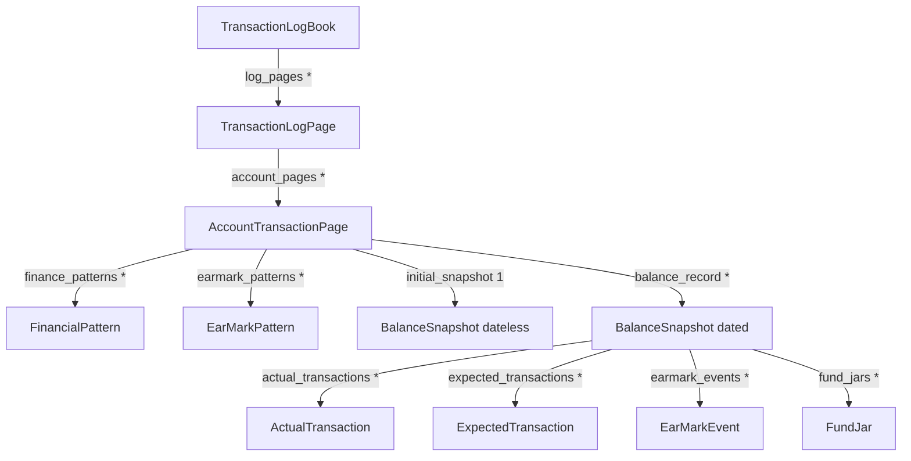

# UML Class Diagram

Reconstructed purely from the documentation (`assumptions/*.txt`, `class documentation.ods`, `psuedo_functions.txt`, `planning.txt`) — not from `classes/*.py`. See [01-glossary-of-terms.md](01-glossary-of-terms.md) for the prose explanation of every property/method named here.

Written in [Mermaid](https://mermaid.js.org/syntax/classDiagram.html) `classDiagram` syntax. If your markdown viewer doesn't render Mermaid inline (GitHub, VS Code with an extension, and Obsidian all do), paste the code block into [mermaid.live](https://mermaid.live) to view it.

## Notation legend

| Symbol | Meaning here |
|---|---|
| `A "1" *-- "0..*" B` | **Composition** — A owns a list/collection of B; B's lifetime is tied to A's. |
| `A ..> B : generates` | **Dependency** — A's data (an `rrule`) produces new instances of B over time; A does not hold direct references to the B's it created. |
| `A --> B : shares finance_id` | **Association by matching key**, not by object pointer. This codebase links most things through a shared `finance_id` (and often a shared date) rather than direct references — see the callout below the diagram. |
| `A <..> B : pairs with` | **Bidirectional, optional association** via mirrored fields on both sides. |

## Diagram

```mermaid
classDiagram
    class TransactionLogBook {
        +int page_length
        +TransactionLogPage[] log_pages
        +find_page_at_date(date)
        +add_bulk_transactions(account_name, files)
        +ad_hoc_initial_balance_adjustment(account_name, date, amount)
    }

    class TransactionLogPage {
        +Date start_date
        +Date end_date
        +AccountTransactionPage[] account_pages
        +add_bulk_transactions(account_name, transactions)
    }

    class AccountTransactionPage {
        +String account
        +Date start_date
        +Date end_date
        +Bool expired
        +Float current_free_amount
        +Float current_unpaid_expected
        +Float current_safety_cushion
        +Float ideal_safety_cushion
        +Int safety_priority
        +FinancialPattern[] finance_patterns
        +EarMarkPattern[] earmark_patterns
        +BalanceSnapshot initial_snapshot
        +BalanceSnapshot[] balance_record
        +Date applied_date
        +cascade_page_balance_record(start_date)
        +set_initial_balance_snapshot(full, free, expected, jars)
        +are_snapshots_adjusted()
        +adjust_snapshots(trigger_update)
        +page_runoff_data()
        +force_expire()
        +is_deallocation_day()
        +calculate_deallocation_earmarks()
        +reverse_implicit_earmarks(date, finance_id)
        +pair_actual_event(finance_id, date)
        +unpair_actual_event(finance_id, date)
        +find_actual(date)
        +find_expected(date, finance_id)
        +earmark_exists(finance_id, date, repeated)
        +find_earmark(finance_id, date, repeated)
        +earmarks_on_day(date)
        +expected_transactions_on_day(date)
        +ScanForMatchs()
    }

    class FinancialPattern {
        +Int finance_id
        +String source
        +rrule date_pattern
        +Float amount
        +FloatPair amount_tolerance
        +FloatPair date_tolerance
        +Int priority
        +Bool mandatory
        +Bool notifications
        +String description
    }

    class EarMarkPattern {
        +Int finance_id
        +rrule date_pattern
        +Float amount
    }

    class ActualTransaction {
        +String source
        +Date occurred_date
        +Int paired_finance_id
        +Date paired_expected_date
        +Bool made_in_bulk
        +Float amount
    }

    class ExpectedTransaction {
        +Int finance_id
        +Date expected_date
        +Bool cancelled
        +Float paired_amount
        +Date paired_actual_date
        +Float expected_amount
        +FloatPair amount_tolerance
        +FloatPair date_tolerance
    }

    class EarMarkEvent {
        +Int finance_id
        +Date earmark_date
        +Bool repeated_earmark
        +Float expected_amount
        +Float explicit_amount
        +Float actual_amount
    }

    class BalanceSnapshot {
        +Date snapshot_date
        +Float full_amount
        +Float expected_amount
        +Float expected_free_amount
        +FundJar[] fund_jars
        +ActualTransaction[] actual_transactions
        +ExpectedTransaction[] expected_transactions
        +EarMarkEvent[] earmark_events
    }

    class FundJar {
        +Int finance_id
        +Float current_amount
        +Float expected_amount
        +Float milestone_amount
    }

    TransactionLogBook   "1" *-- "0..*" TransactionLogPage      : log_pages
    TransactionLogPage   "1" *-- "0..*" AccountTransactionPage  : account_pages
    AccountTransactionPage "1" *-- "0..*" FinancialPattern      : finance_patterns
    AccountTransactionPage "1" *-- "0..*" EarMarkPattern        : earmark_patterns
    AccountTransactionPage "1" *-- "1"    BalanceSnapshot       : initial_snapshot
    AccountTransactionPage "1" *-- "0..*" BalanceSnapshot       : balance_record
    BalanceSnapshot "1" *-- "0..*" ActualTransaction    : actual_transactions
    BalanceSnapshot "1" *-- "0..*" ExpectedTransaction  : expected_transactions
    BalanceSnapshot "1" *-- "0..*" EarMarkEvent         : earmark_events
    BalanceSnapshot "1" *-- "0..*" FundJar              : fund_jars

    FinancialPattern "1" ..> "0..*" ExpectedTransaction : generates via rrule
    EarMarkPattern   "1" ..> "0..*" EarMarkEvent        : generates via rrule
    EarMarkPattern   "1" --> "1"    ExpectedTransaction : saves for shares finance_id, 1-to-1 goal
    EarMarkEvent     "0..*" --> "1" FundJar             : deposits withdraws shares finance_id
    ExpectedTransaction "0..1" <..> "0..1" ActualTransaction : pairs with mirrored fields
```

## Why so many relationships are dashed / key-based instead of solid arrows

A conventional UML class diagram mostly shows composition (object-owns-object). This design leans heavily on a different mechanism: most cross-class "relationships" are enforced by **matching a shared `finance_id` (and sometimes a date)**, not by one object holding a pointer to another. That's a deliberate, recurring pattern here, not an accident of translation into UML — it shows up explicitly in the assumptions (e.g. `3.10.a3`: "if an `EarMarkPattern`, `EarMarkEvent`, `FundJar`, or `ExpectedTransaction` exists with a `finance_id` of x and the page has no `FinancialPattern` with `finance_id` x, that instance shouldn't exist").

Concretely:
- A `FundJar` doesn't hold a reference to its `EarMarkPattern`; both just happen to share a `finance_id`, and an assumption (`9.5.1.a1`) guarantees uniqueness so the match is unambiguous.
- An `EarMarkEvent` doesn't point at the `ExpectedTransaction` it's saving for; again, matched by `finance_id`.
- `ExpectedTransaction` ↔ `ActualTransaction` pairing is the most explicit example: it's a full 4-field mirror match (`paired_amount`/`paired_actual_date` on one side, `paired_finance_id`/`paired_expected_date` on the other), described at length in `psuedo_functions.txt`'s discrepancy-clearing functions. See [Pairing / Fulfillment](01-glossary-of-terms.md#domain-vocabulary) in the glossary.

This is why the diagram uses dependency (`..>`) and plain association (`-->`) arrows labeled "shares finance_id" for those links rather than aggregation/composition arrows — there's no containership, only a referential-integrity guarantee enforced by assumptions rather than by the object graph itself.

## Relationships intentionally left off the diagram

- **`AccountTransactionPage.safety_priority` / the safety cushion "acting like a fund jar with priority 0"** (per `planning2simple.txt`) is a conceptual analogy, not a structural relationship — there's no actual `FundJar` object wired to `safety_priority`, just a `FundJar` with `finance_id = None` that happens to behave similarly during fund allocation. Modeling it as an arrow would overstate how literally connected they are.
- **The pre-final-design grouping nodes** (`EventPlanner`, `PairedTransactions`/`TransactionPair`, `LooseTransactions`, `BalanceRecord` as its own class) from `fakexmltest.txt`/`planning.txt` are deliberately omitted — see the [Conceptual groupings that aren't classes](01-glossary-of-terms.md#conceptual-groupings-that-arent-classes) table in the glossary for where each one actually landed in the 10-class design this diagram reflects.
- **Cross-page cascade links** (e.g., a `FinancialPattern` whose `rrule` spans into the next `AccountTransactionPage`, per assumption `1.2.3.10.a1`) aren't drawn as object relationships because they aren't object relationships — they're a temporal consistency rule ("both patterns must have the exact same rrule, start date, and end date") enforced across two independently-existing pattern instances, one per page. This is exactly the kind of link [03-assumptions-glossary.md](03-assumptions-glossary.md) exists to catalog instead.

## Containment-only view (for a simpler mental model)

If you just want "what owns what," collapsing every dependency/key-match relationship out:

