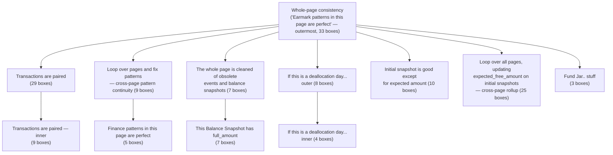
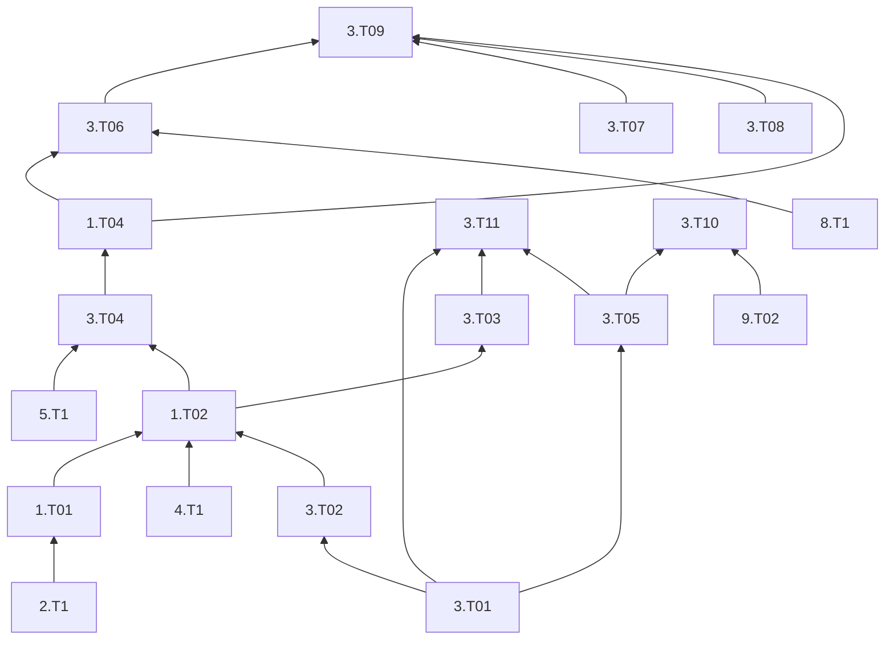

# Assumption Dependency Graph

> **⚠ CORRECTION BANNER (2026-07-18) — read before trusting the drawn-edge data below.** Author review (recorded in [07-assumption-open-questions.md](07-assumption-open-questions.md), observations 7–9) established that this document's edge and region reconstruction has a **systematic parsing defect**: `uxf_graph_tool.py` resolves each arrow endpoint to the nearest **box**, but the chart routes many edges **line→line** (several source lines merge into one shared arrow before it reaches a box). Consequences, all author-confirmed:
> - **The "33 dangling edges" (Discrepancy #1) are not real** — they are shared-arrow junctions the parser couldn't follow. There is no deleted box cluster; `1.2.a1` has exactly **2** incoming arrows, not ~17.
> - **Discrepancy #4 is withdrawn** — `5.2.a1` has **no** incoming arrows; the "`3.13.1.a1` → `5.2.a1`" edge was a mis-resolution. `3.13.1.a1`'s requirement set is its box text `{3.2.a1, 3.2.a2, 3.3.a1, 3.3.a2}`.
> - **Every `(LOW CONFIDENCE)` edge is suspect**, and some "duplicate" edges are single edges double-counted.
> - **The Process-regions section's memberships are wrong** — see the author-corrected region table in [07](07-assumption-open-questions.md#author-corrected-region-memberships-authoritative-2026-07-18). The "moments outside all regions = user-interaction windows" reading is **retired** (author: regions were a visualization aid, not an interaction-timing spec).
> - **The line-style legend is otherwise confirmed** (arrow points dependent→prerequisite; orange = previous instance, red = next-instance / forward re-validation; `layer=` tags are meaningless z-order).
>
> **→ The corrected graph now lives in [08-assumption-graph-reconciled.md](08-assumption-graph-reconciled.md)** (built 2026-07-18 from the box-text requirement sets — 154 assumptions, zero dangling references, a clean acyclic DAG in 21 topological layers). **Use 08 for all dependency questions, not this document's drawn-edge list.** This file (05) is retained for its prose analysis, the test-bundle plan, and the chart-vs-`.txt` per-chapter notes — but its *wired-edge* claims, confidence flags, dangling-edge list, and region memberships are superseded (the region memberships specifically by the author-corrected table in [07](07-assumption-open-questions.md#author-corrected-region-memberships-authoritative-2026-07-18)).

The reconstructed directed graph of all 118 assumptions in `assumptionChartSimpleLines.uxf`, plus two things layered on top of it that turned out to live in the chart alongside the plain "requires" edges: **process regions** (candidate answers to "what are the time periods during which the user can interact with the system") and a **test-bundling plan** (from a sibling chart, `assumptionChartTests.uxf` — directly relevant now that "testing first" is on the table).

This is long by design, per your instructions. Use the table of contents to jump around rather than reading top to bottom.

## Contents
- [Methodology](#methodology)
- [Legend: what each line style means](#legend-what-each-line-style-means)
- [Chart provenance recap](#chart-provenance-recap)
- [The dependency graph, by chapter](#the-dependency-graph-by-chapter)
- [Chart-only content (not in any .txt file)](#chart-only-content-not-in-any-txt-file)
- [Process regions](#process-regions)
- [Test plan (from assumptionChartTests.uxf)](#test-plan-from-assumptioncharttestsuxf)
- [Discrepancies & open questions](#discrepancies--open-questions)
- [Tooling](#tooling)

---

## Methodology

`assumptionChartSimpleLines.uxf` is UMLet's XML format: every assumption is a `UMLClass` box (position + free-text label), every arrow is a `Relation` (a polyline of x;y points plus a style string like `lt=<-`), and there are a handful of plain `Text` elements used as process-step annotations. UMLet anchors a relation to a shape's *border*, not its center, so I resolved each relation's first/last polyline point to the box whose bounding rectangle contains it (falling back to nearest-by-center-distance when a point lands just outside every box, which is normal — arrows stop a few units short of the border to leave room for the arrowhead).

That resolution was done with a small script (see [Tooling](#tooling)), not by hand, and cross-checked in several ways before I trusted it:
- Verified against a known dependency from the `.txt` catalog (`2.3.a1` requires `3.a1`) to confirm arrow direction (`lt=<-` points from the *dependent* box back at its *prerequisite* — i.e., reading an edge as "A ← B" means "A requires B," matching how [03-assumptions-glossary.md](03-assumptions-glossary.md) writes `{B} -A: ...`).
- Cross-referenced every resolved edge against the prose in [03-assumptions-glossary.md](03-assumptions-glossary.md) where a matching assumption existed there.
- Attempted (and abandoned — see [Discrepancies](#discrepancies--open-questions)) cross-file coordinate matching against `assumptionChart.uxf` to recover a handful of broken edges; the three files use three different UMLet `zoom_level`s and the coordinate systems don't reconcile by simple rescaling.

**Confidence labeling:** every edge below is either plain, or marked `(LOW CONFIDENCE d=N)`. That means the worse of the two endpoints sat more than 100 units from any box's center — well outside the normal 20-60 unit border gap — which usually means the arrow is a leftover from an edit (its partner box was moved or deleted and the line never got cleaned up). Where I marked something low-confidence, **the assumption ID shown is still the single nearest box** — treat it as "something used to connect here, probably not this" rather than "this is definitely wrong." Full list, with distances, in [Discrepancies](#discrepancies--open-questions).

I fully parsed `assumptionChartSimpleLines.uxf` (the file `assumptionNotes.txt` calls authoritative) and `assumptionChartTests.uxf` (which turned out to hold the test-bundling material). I used `assumptionChart.uxf` (the original, larger, pre-reduction chart) only for a box-inventory diff, not a full edge parse. I did not parse `assumptionChartNoLines*.uxf`, `assumptionChartTiers1.uxf` (confirmed to have zero relations — pure box layout, presumably a visual for the `allReduced*` stratification layers, not a source of new edges), `assumptionChartSimpleLines1-8.uxf` (confirmed near-duplicates of the final file — see [00-sources-and-notes.md](00-sources-and-notes.md)), or `assumptionChartSimpleLinesChecks.uxf` (confirmed empty — zero elements). If you want those mined too, the tool in [Tooling](#tooling) is set up to make that quick.

## Legend: what each line style means

None of this is stated anywhere in the source files — it's inferred from patterns in the data (detailed in [Discrepancies](#discrepancies--open-questions) where the inference is shakier than others). Treat it as a strong working hypothesis, not a confirmed key.

| Style | Meaning (inferred) |
|---|---|
| `lt=<-` (plain) | Standard "requires" edge — the arrow points from a dependent assumption back at its prerequisite. The overwhelming majority (167/193) of edges. |
| `lt=<-` + a bare letter/number combo like `3p`, `13c`, `13b, c, f` | Same "requires" relationship, but scoped to a specific instance per the Before/Current/Following/Previous/Next grammar in [03-assumptions-glossary.md](03-assumptions-glossary.md#how-to-read-an-assumption-id) — e.g. `3p` reads as "this dependency is on the **p**revious `AccountTransactionPage`'s version of assumption 3." |
| `fg=orange` | Consistently paired with a `p` (Previous) scope tag in this chart. Reads as "this edge crosses backward into the prior page." |
| `fg=red` | Paired with `n` (Next) or `c` (Current) scope tags, *and* also appears twice with no scope tag at all (just `bg=red\nfg=red`). The scoped uses read as "crosses forward into the next page" by analogy with orange/previous; the two unscoped red edges don't fit that pattern and both happen to be low-confidence/suspect edges (see [Discrepancies](#discrepancies--open-questions)) — possibly red was also being used ad hoc to flag "this edge looks wrong," which would make it a second, unrelated meaning layered onto the same color. |
| `layer=2` | Seen only alongside `fg=orange`/`fg=red` edges, never on a plain edge. Likely a UMLet z-order/rendering layer, but given `layer=` numbers also show up on individual assumption *boxes* (see next table) and the `allReduced*` files independently produced numbered dependency "layers" via topological stratification, it's plausible — not confirmed — that these numbers are meant to correspond to that stratification, not just visual stacking order. |
| `lt=.` / `lt=..` on a **closed polygon** (first point = last point) | Not an edge at all — an outline drawn around a cluster of boxes. See [Process regions](#process-regions). The single vs. double dot appears to mark inner vs. outer nesting level where regions overlap, not two unrelated meanings. |

Individual **boxes** (not edges) also carry their own style tags, worth knowing before you read the adjacency list:

| Box tag | Boxes carrying it | Reads as |
|---|---|---|
| `bg=pink` | `1.2.3.13.a2`, `3.10.a3`, `3.13.5.a4`, `3.13.6.a2`, `3.13.7.a4`, `3.13.8.a7`, `3.13c.a6` | "Has all X" completeness-check assumptions — the aggregate "we didn't miss anything" checks. |
| `bg=light_gray` | `1.2.3c.10.a4`, `1.2.3c.11.a4`, `1.2.3c.12.a1`, `1.2.3c.12.a2`, `3.13.5.a5`, `3.13.6.a3`, `3.13.7.a5`, `3.a1`, `3.a2` | "X is maintained / is perfect" milestone assumptions — the high-level summary nodes that many other assumptions ultimately point back to. |
| `layer=1` | Most of the Balance Record / Fund Jars / Actual / Expected / Earmarks chapters (Ch.11-16) | Unclear whether this is purely a UMLet rendering hint or a stratification marker (see above) — flagged, not resolved. |

## Chart provenance recap

Full detail in [00-sources-and-notes.md](00-sources-and-notes.md); the two facts that matter for reading this graph:

1. **`assumptionChartSimpleLines.uxf` (118 boxes) is a near-total superset of `assumptionChart.uxf` (the original, 146-box chart)** once you account for the chart's habit of bundling several related assumption IDs into one visual box (e.g. the box labeled `6.1.a1` also contains `6.5.a1` and `6.6.a1` in full). Counting every ID actually declared inside a box's text, not just the one used as its label, the original chart declares 152 assumption IDs and the final chart declares 163 — **only one assumption present in the original is missing from the final: `3.4.a1`** ("expired cannot be None"). See [Discrepancies](#discrepancies--open-questions).
2. The chart contains a small amount of content that exists **nowhere** in `a01.txt`/`a02.txt`/`a03.txt` — new assumptions and refinements that only ever got written down here. See [the dedicated section below](#chart-only-content-not-in-any-txt-file).

## The dependency graph, by chapter

Same 19 chapters as [03-assumptions-glossary.md](03-assumptions-glossary.md), so you can flip between "what it says" and "how it connects." For each assumption: what it requires (confirmed in the chart) and what requires it (its dependents) — both directions, since "what breaks if I change this" is at least as useful as "what does this depend on."

Where the chart shows **no** incoming requirement arrow for an assumption, that's noted as `(none found in chart)` — for leaf assumptions this matches `{none}` in the `.txt` catalog exactly; where it doesn't match (i.e., the `.txt` file lists a requirement the chart doesn't show), that's a discrepancy worth its own callout inline.

### Ch.1 TransactionLogPage
- **`2.1.a1`** — requires: *(none found in chart — matches `{none}`)*. Required by: `1.2.3.a1`.
- **`2.2.a1`** — requires: *(none — matches `{none}`)*. Required by: `1.2.3.a1`.
- **`2.3.a1`** — requires: `3.1.a1`, `3.13.2.a4`, `3:13.a9`. Required by: `1.2.a1`.
  - *Note:* the `.txt` catalog gives `2.3.a1`'s requirement as simply `{3.a1}` (the whole page being maintained). The chart instead points at three of `3.a1`'s own sub-components directly (`3.1.a1`, `3.13.2.a4`, `3:13.a9`) rather than at `3.a1` itself — a more granular (and arguably more honest) version of the same dependency, not a contradiction.

### Ch.2 FinancialPattern
- **`4.1.a1`** — requires: *(none — matches `{none}`)*. Required by: `1.2.3.10.a1`.
- **`4.2.a1`** — requires: *(none — matches `{none}`)*. Required by: `1.2.3.10.a1`.

### Ch.3 EarMarkPattern
- **`5.1.a1`** — requires: *(none — matches `{none}`)*. Required by: `1.2.3c.11.a4`, `7.1.a1`.
- **`5.2.a1`** — requires: *(none — matches `{none}`)*. Required by: `3.13.1.a1`, `7.1.a1`. *(Box text adds: "self.date_pattern rrule must have until property, not count property" — see [chart-only content](#chart-only-content-not-in-any-txt-file).)*
- **`5.3.a1`** — requires: *(none — matches `{none}`)*. Required by: `7.1.a1`.

### Ch.4 ActualTransaction
- **`6.1.a1`** — requires: *(none — matches `{none}`)*. Required by: `3.13.5.a3`. *(Box bundles `6.5.a1`, `6.6.a1` alongside it, both also `{none}`.)*
- **`6.4.a1`** — requires: *(none — matches `{none}`)*. Required by: `1.2.3.13.a2`.

### Ch.5 ExpectedTransaction
- **`7.1.a1`** — requires: `1.2.3.10.a1`, `3.13.7.6.a1`, `3.13.7.a2`, `5.1.a1`, `5.2.a1`, `5.3.a1`. Required by: `3.13.7.a4`; also `3.13.a2` `[bg=red/fg=red]` *(LOW CONFIDENCE d=104.7 — see discrepancies)*.
  - *Note:* the `.txt` catalog gives `7.1.a1` as a simple `{none}` leaf assumption. The chart shows it with six real prerequisites — a substantial, chart-only expansion. Trust the chart here; it's far more specific and internally consistent with the rest of the graph.
- **`7.3.a1`** — requires: `3.13.7.a1`, `3.2.a1`. Required by: `3.10.a3`.
- **`7.4.a1`** — requires: `9.7.6.a1`. Required by: `3.10.a3`, `3.13.8.a7`. *(Box bundles `7.4.a2`, `7.5.a1`, `7.5.a2`, all `{none}`.)*
- **`7.6.a1`** — requires: *(none — matches `{none}`)*. Required by: `3:13.a9`. *(Box bundles `7.7.a1`, `7.8.a1` under `7.1.a1`'s box instead — see full box text in the raw dump if reconciling by hand.)*

### Ch.6 EarmarkEvent
- **`8.1.a1`** — requires: *(none — matches `{none}`)*. Required by: `1.2.3c.13.a3`. *(Box bundles `8.2.a1`, `8.3.a1`, `8.5.a1`.)*
- **`8.4.a1`** — requires: `3.13.6.a2` `[13b,c,f]`, `8.4.a2`. Required by: *(nothing in chart)*.
- **`8.4.a2`** — requires: *(none — matches `{none}`)*. Required by: `3.10.a3`, `8.4.a1`, `9.5.1.a1`.

### Ch.7 BalanceSnapshot
- **`9.1.a1`** — requires: *(none)*. Required by: `1.2.3c.12.a1`.
- **`9.5.a1`** — requires: `3.13.5.a1`. Required by: `3.13.5.2.a3` *(LOW CONFIDENCE d=110.9)*; also shows as required by `1.2.a1` *(LOW CONFIDENCE d=225.4 — almost certainly spurious, see discrepancies)*.
  - *Note:* the `.txt` catalog gives `9.5.a1`'s requirement as `{10.3.a1, 10.4.a1}` (the FundJar rules it structurally depends on). The chart instead shows it requiring `3.13.5.a1` (a fund-jar-existence rule at the page level). Both readings are plausible; this isn't necessarily a contradiction so much as two different "lowest sufficient" prerequisites — see the assumption-numbering note in [01-glossary-of-terms.md](01-glossary-of-terms.md#naming-quirks--open-questions).
- **`9.5.1.a1`** — requires: `8.4.a2`. Required by (low confidence, see discrepancies): `3.13c.a7`, `3.a2`.
- **`9.6.2.a1`** — requires: *(none)*. Required by: *(nothing in chart)*.
- **`9.7.6.a1`** — requires: *(none)*. Required by: `7.4.a1`.
- **`9.8.2.a1`** — requires: *(none)*. Required by: `1.2.3c.12.a1`.
- **`9.8.6.a1`** — requires: *(none)*. Required by: `1.2.3c.12.a1`.

### Ch.8 FundJar
- **`10.3.a1`** — requires: `1.2.3c.11.a4`. Required by: `3.10.a3`.
- **`10.4.a1`** — requires: *(none)*. Required by: `3.10.a3`, `3.13.8.1.a3`. *(Box adds two brand-new sub-rules, `10.4.a2`/`10.4.a3` — see [chart-only content](#chart-only-content-not-in-any-txt-file).)*

### Ch.9 Page identity, bounds & top-level summary
- **`3.a1`** ("this page is maintained") — requires: `1.2.3c.12.a2`; also `3.13c.2.a1` `[13c,f]` *(LOW CONFIDENCE d=151.9)*. Required by: `1.2.3.5.a1`.
  - *Note:* the `.txt` catalog gives `3.a1` a much bigger requirement set (`1.2.3c.12.a2, 3.13.2.a4, 3.13.3.a1, 3.13.7.a5, 3.13.6.a3, 3.13.8.a8, 3.13.5.a5, 3.13.a9`). The chart's box text for `3.a1` actually *lists* that same full set in its `{...}` — the graph edges just didn't all get drawn (only 2 of the 8 are wired up as real arrows; the rest may be among the dangling/suspect edges elsewhere in the graph, or simply never drawn). Read the box text as the source of truth for *what* it requires; read the wired edges as an incomplete subset of *confirmed-by-arrow* requirements.
- **`3.a2`** — requires: `1.2.3.5.a1`, `1.2.3c.12.a2`, `3.1.a1`, `3.13.5.4.a1`, `3.13.5.a5`, `3.13.6.a3`, `3.13.7.a5`, `3.13.8.a8`, `3.7.a1`; also low-confidence hits on `3.13.a4` and `9.5.1.a1`. Required by: `1.2.a1`.
- **`3.1.a1`** — requires: `1.2.3.12.3.a2`, `1.2.3c.12.a3`, `3.13.5.3.a1`. Required by: `1.2.3.6.a1` `[3p/orange]`, `2.3.a1`, `3.a2`.
- **`3.2.a1`** — requires: *(none — matches `{none}`)*. Required by: `1.2.3.10.a1`, `7.3.a1`; low-confidence hit from `1.2.a1` (d=1699.6 — see discrepancies, this one's almost certainly cruft).
- **`3.2.a2`** — requires: *(none)*. Required by: `3.13.8.1.a3`; low-confidence hit from `1.2.a1` (d=1698.8).
- **`3.3.a1`** — requires: *(none)*. Required by: low-confidence hit from `1.2.a1` only (d=1698.2) — this box shows **no confirmed dependents at all** in the wired graph.
- **`3.3.a2`** — requires: *(none)*. Required by: `3.10.a1`, `3.13.8.1.a3`; low-confidence hit from `1.2.a1` (d=1697.6).
- **`3.5.a1`** — requires: *(none — matches its `.txt` requirement of `{3.2.a1,3.2.a2,3.3.a1,3.3.a2}` only loosely; the chart shows no wired edges for it at all)*. Required by: *(nothing wired)*.
- **`3.7.a1`** — requires: *(none wired; `.txt` says `{1.2.3c.12.a2}`)*. Required by: `3.a2`.
- **`3.7.a2`** — requires: *(none wired; `.txt` says `{1.2.3c.12.a2}`)*. Required by: `3.13.4.a1` `[3p/orange/layer=2]`.
- **`3.8.a1`** — requires: *(none — matches `{none}`)*. Required by: `3.13c.5.2.a4`.
- **`3.9.a1`** — requires: `3.13.5.a1` *(chart-only refinement; `.txt` says `{none}`)*. Required by: `3.13c.5.2.a4`.
- **`3.10.a1`** — requires: `1.2.3c.11.a1` `[3p/orange]`, `3.3.a2`. Required by: *(nothing wired)*.
- **`3.10.a2`** — requires: *(none — matches `{none}`)*. Required by: `1.2.3c.10.a4`.
- **`3.10.a3`** — requires: `10.3.a1`, `10.4.a1`, `3.13.5.a1`, `3.13.6.a1`, `7.3.a1`, `7.4.a1`, `8.4.a2`. Required by: `3.13.a4` *(LOW CONFIDENCE d=122.7)*.
- **`3.11.1.a1`** — requires: *(none — matches `{5.1.a1}` loosely; not wired)*. Required by: `1.2.3c.11.a4`.
- **`3.11.2.a1`** — requires: `1.2.3c.10.a4` *(chart-only; `.txt` says `{5.2.a1}`)*. Required by: `1.2.3c.11.a2`, `1.2.3c.11.a3`.

### Ch.10 Initial Snapshot
- **`3.12.a1`** — requires: *(none wired; `.txt` says `{1.2.3c.12.a2}`)*. Required by: `3.13.3.a1`.
- **`3.12.1.a1`** — requires: *(none — matches `{none}`)*. Required by: `3.13.3.a1`. *(Box bundles `3.12.6.a1`, `3.12.7.a1`, `3.12.8.a1`, all `{none}`.)*
- **`3.12.5.a1`** — requires: *(none wired)*. Required by: low-confidence hit from `1.2.a1` only (d=365.9 — see discrepancies).

### Ch.11 Balance Record
- **`3.13.a2`** — requires: `3.13.8.a7`; also `7.1.a1` `[bg=red/fg=red]` *(LOW CONFIDENCE d=104.7)*. Required by: `1.2.3c.13.a3`.
- **`3.13.a3`** — requires: `1.2.3c.13.a3`. Required by: `3.13.a4`.
- **`3.13.a4`** — requires: `3.13.a3`, `3.13.8.4.a1`; plus three low-confidence hits (`3.10.a3`, `3.13.5.a3`, `3.13.6.a2` — all d>100, see discrepancies, though all three are *also* genuinely plausible per the `.txt` catalog's `{3.13.6.a2, 3.13.a3}`). Required by: `3.13c.2.a2`, `3.13c.2.a3`; low-confidence hits from `1.2.a1` and `3.a2`.
- **`3.13.a5`** — requires: *(none wired; `.txt` gives a full set of b/c/f-scoped requirements)*. Required by: `1.2.3.13.a1` `[13b,c,f]`.
- **`3.13c.a6`** — requires: `1.2.3.12.4.a2` `[13p/orange]`, `3.13c.8.4.a2` `[13p/orange/layer=2]`. Required by: `3.13c.8.4.a2`.
- **`3.13c.a7`** — requires: `9.5.1.a1` *(LOW CONFIDENCE d=124.1)*. Required by: `3.13c.2.a3` `[13p/orange/layer=2]`, `3.13c.8.4.a2`. *(Box also introduces brand-new `3.13c.a10` — see [chart-only content](#chart-only-content-not-in-any-txt-file).)*
- **`3.13c.a8`** — requires: `3.13c.8.4.a2`. Required by: `3.13c.5.2.a4`.
- **`3:13.a9`** — requires: `3.13.8.6.a1`, `7.6.a1`. Required by: `2.3.a1`.
- **`3.13.1.a1`** — requires: `5.2.a1` *(chart-only; `.txt` says `{3.2.a1,3.2.a2,3.3.a1,3.3.a2}` — see discrepancies, this substitution looks like a genuine chart error)*. Required by: `3.13.7.a3`; low-confidence hit from `3.13.5.a3`.

### Ch.12 `balance_record[c].full_amount` & expected amounts
- **`3.13c.2.a1`** — requires: `3.13c.2.a3`. Required by: `3.13c.2.a2` (twice, two different style-tagged edges — see discrepancies for the duplicate); low-confidence hit from `3.a1`.
- **`3.13c.2.a2`** — requires: `3.13.a4`, `3.13c.2.a1` (twice). Required by: `1.2.3.12.4.a2`.
- **`3.13c.2.a3`** — requires: `1.2.3.12.2.a1`, `3.13.a4`, `3.13c.a7` `[13p/orange/layer=2]`. Required by: `3.13c.2.a1`.
- **`3.13.2.a4`** — requires: *(none wired; `.txt` says `{3.13c.2.a1,3.13f.2.a1}`)*. Required by: `1.2.3c.12.a1` `[3p/orange]`, `2.3.a1`.
- **`3.13.3.a1`** — requires: `1.2.3c.12.a1`, `3.12.1.a1`, `3.12.a1`; self-referential `3.13.3.a1` `[13p/orange]` (a genuine Previous-page self-reference, not an error — see the ID grammar). Required by: `1.2.3.6.a1`, `3.13.4.a1`.
- **`3.13.4.a1`** — requires: `1.2.3.12.4.a2`, `3.13.3.a1`, `3.7.a2` `[3p/orange/layer=2]`; low-confidence hit on `1.2.3c.12.a1` (d=115.0). Required by: *(nothing wired)*.

### Ch.13 Fund Jars
- **`3.13.5.a1`** — requires: `1.2.3c.10.a4`, `3.13.8.a2`. Required by: `3.10.a3`, `3.13.5.a3`, `3.13.6.a2`, `3.9.a1`, `9.5.a1`; low-confidence hit from `1.2.a1`.
- **`3.13.5.a3`** — requires: `3.13.5.a1`, `6.1.a1`; low-confidence hit on `3.13.1.a1` (d=102.1). Required by: `3.13.a4` (low confidence, mutual).
- **`3.13.5.a4`** — requires: *(none wired)*. Required by: `3.13c.5.2.a4`.
- **`3.13.5.a5`** — requires: `3.13.5.3.a1`. Required by: `3.a2`.
- **`3.13.5.2.a1`** — requires: `1.2.3.13.a2`. Required by: *(nothing wired)*.
- **`3.13.5.2.a2`** — requires: `3.13c.5.2.a5`. Required by: `3.13.8.1.a1` `[13c/red]`.
- **`3.13.5.2.a3`** — requires: `3.13.6.a2`; low-confidence hit on `9.5.a1` (d=110.9). Required by: `1.2.3.12.4.a2` `[13b,c,f]`, `3.13c.5.2.a5`.
- **`3.13c.5.2.a4`** — requires: `3.13.5.a4`, `3.13c.a8`, `3.8.a1`, `3.9.a1`. Required by: `3.13c.5.2.a5`.
- **`3.13c.5.2.a5`** — requires: `3.13.5.2.a3`, `3.13.8.a7`, `3.13c.5.2.a4`. Required by: `3.13.5.2.a2`; low-confidence self-adjacent hit from `3.13.5.3.a1` (d=101.8).
- **`3.13.5.3.a1`** — requires: low-confidence-only hit on `3.13c.5.2.a5` (d=101.8 — but this is almost certainly real; see discrepancies). Required by: `1.2.3.12.3.a2` `[3p/orange]`, `1.2.3c.12.a1` `[3n/red]`, `3.1.a1`, `3.13.5.a5`, `3.13.8.6.a1`.
- **`3.13.5.4.a1`** — requires: *(none wired; `.txt` gives a rich set)*. Required by: `3.a2`.

### Ch.14 Actual Transactions
- **`3.13.6.a1`** — requires: `1.2.3c.11.a4`. Required by: `3.10.a3`; low-confidence hit as a requirement of `3.13.8.a7` (d=104.0, tagged `bg=red/fg=red`).
- **`3.13.6.a2`** — requires: `3.13.5.a1`. Required by: `3.13.5.2.a3`, `3.13.8.5.a1`, `8.4.a1` `[13b,c,f]`; low-confidence hit as a requirement of `3.13.a4`.
- **`3.13.6.a3`** — requires: *(none wired; `.txt` says `{1.2.3.13.a2, 3.13.6.a2}`)*. Required by: `3.a2`.

### Ch.15 Expected Transactions
- **`3.13.7.6.a1`** — requires: `1.2.3c.10.a4`. Required by: `7.1.a1`.
- **`3.13.7.a1`** — requires: *(none wired; `.txt` says `{1.2.3c.10.a4}`)*. Required by: `7.3.a1`.
- **`3.13.7.a2`** — requires: `1.2.3c.10.a4`. Required by: `7.1.a1`.
- **`3.13.7.a3`** — requires: `3.13.1.a1`. Required by: low-confidence hit from `1.2.a1` (d=689.4).
- **`3.13.7.a4`** — requires: `7.1.a1`. Required by: `1.2.3.13.6.a1` `[13b,c,f]`, `3.13c.8.a4`; low-confidence hit from `1.2.a1` (d=759.4).
- **`3.13.7.a5`** — requires: *(none wired)*. Required by: `3.a2`.

### Ch.16 Earmarks
- **`3.13.8.a1`** — requires: *(none wired; `.txt` says `{1.2.3c.11.a4}`)*. Required by: `1.2.3c.13.a3`.
- **`3.13.8.a2`** — requires: `1.2.3c.11.a1`, `1.2.3c.11.a4`. Required by: `1.2.3c.13.a3`, `3.13.5.a1`; low-confidence hit from `1.2.a1`.
- **`3.13.8.a3`** — requires: *(none wired)*. Required by: *(nothing wired)*.
- **`3.13c.8.a4`** — requires: `3.13.7.a4`, `3.13.8.5.a1`. Required by: `3.13c.8.a5`.
- **`3.13c.8.a5`** — requires: `3.13c.8.a4`. Required by: `3.13.8.a7`.
- **`3.13.8.a6`** — requires: *(none wired; `.txt` gives a full set)*. Required by: `3.13.8.a7`; low-confidence hit from `1.2.a1`.
- **`3.13.8.a7`** — requires: `3.13.8.1.a1`, `3.13.8.3.a1`, `3.13.8.a6`, `3.13c.8.a5`, `7.4.a1`; low-confidence hit on `3.13.6.a1` (d=104.0, `bg=red/fg=red`). Required by: `3.13.a2`, `3.13c.5.2.a5`.
- **`3.13.8.a8`** — requires: *(none wired; `.txt` says `{3.13b.a8, 3.13c.a8, 3.13f.a8}`)*. Required by: `3.a2`.
- **`3.13.8.1.a1`** — requires: `3.13.5.2.a2` `[13c/red]`. Required by: `3.13.8.a7`. *(Box bundles `3.13.8.1.a2`.)*
- **`3.13.8.1.a3`** — requires: `10.4.a1`, `3.13.7.a3`, `3.2.a2`, `3.3.a2`. Required by: *(nothing wired)*.
- **`3.13.8.3.a1`** — requires: *(none wired; `.txt` says `{1.2.3c.11.a4}`)*. Required by: `3.13.8.a7`.
- **`3.13.8.4.a1`** — requires: *(none wired; `.txt` says `{1.2.3c.11.a4}`)*. Required by: `1.2.3c.11.a4` `[3p/orange]`, `1.2.3c.13.a3`, `3.13.a4`.
- **`3.13c.8.4.a2`** — requires: `3.13c.a6`, `3.13c.a7`. Required by: `3.13c.a6` `[13p/orange/layer=2]`, `3.13c.a8`.
- **`3.13.8.5.a1`** — requires: `3.13.6.a2`. Required by: `3.13c.8.a4`.
- **`3.13.8.6.a1`** — requires: `3.13.5.3.a1`. Required by: `3:13.a9`. *(Box bundles `3.13.8.6.a2`, same requirement.)*

### Ch.17 log_pages, pattern continuity across pages
- **`1.2.a1`** — requires: `1.2.3.12.5.a2`, `2.3.a1`, `3.a2`, plus a long tail of low-confidence hits (`1.2.3.13.a2` ×2, `1.2.3c.10.a4`, `3.12.5.a1`, `3.13.5.a1`, `3.13.7.a3`, `3.13.7.a4`, `3.13.8.a2`, `3.13.8.a6`, `3.13.a4`, `3.2.a1`, `3.2.a2`, `3.3.a1`, `3.3.a2`, `9.5.a1`). This box is the single biggest source of low-confidence edges in the whole graph — see [Discrepancies](#discrepancies--open-questions), it looks like `1.2.a1`'s box sits in a spot that many now-orphaned arrows happen to be nearest to, not that it genuinely requires seventeen things. Required by: `1.2.3.12.5.a2` `[3n/red]`, `1.2.3c.12.a3` `[3p/orange]` (both also low-confidence).
- **`1.2.3.a1`** — requires: `2.1.a1`, `2.2.a1`. Required by: *(nothing wired)*.
- **`1.2.3.10.a1`** — requires: `3.2.a1`, `4.1.a1`, `4.2.a1`. Required by: `1.2.3c.10.a4`, `7.1.a1`. *(Box bundles `1.2.3.10.a2`, `1.2.3.10.a3`.)*
- **`1.2.3c.10.a4`** — requires: `1.2.3.10.a1`, `3.10.a2`. Required by: `3.11.2.a1`, `3.13.5.a1`, `3.13.7.6.a1`, `3.13.7.a2`; low-confidence hit from `1.2.a1` (d=852.3).
- **`1.2.3c.11.a1`** — requires: *(none wired; `.txt` gives a full set)*. Required by: `3.10.a1` `[3p/orange]`, `3.13.8.a2`.
- **`1.2.3c.11.a2`** — requires: `3.11.2.a1`. Required by: `1.2.3c.11.a4` (low confidence, d=88.2, but almost certainly real — see discrepancies).
- **`1.2.3c.11.a3`** — requires: `3.11.2.a1`. Required by: `1.2.3c.11.a4`.
- **`1.2.3c.11.a4`** — requires: `1.2.3c.11.a2`, `1.2.3c.11.a3`, `3.11.1.a1`, `3.13.8.4.a1` `[3p/orange]`, `5.1.a1`. Required by: `10.3.a1`, `3.13.6.a1`, `3.13.8.a2`; low-confidence hits from `1.2.3c.13.a3` (×2).

### Ch.18 Derived calculations & initial-snapshot inheritance
- **`1.2.3.5.a1`** — requires: `1.2.3.6.a1`, `3.a1`. Required by: `3.a2`.
- **`1.2.3.6.a1`** — requires: `1.2.3.12.4.a1`, `1.2.3c.12.a2`, `3.1.a1` `[3p/orange]`, `3.13.3.a1`; low-confidence hit on `1.2.3.12.5.a2` (d=120.1). Required by: `1.2.3.12.4.a2` `[3p/orange]`, `1.2.3.5.a1`.
- **`1.2.3c.12.a1`** — requires: `3.13.2.a4` `[3p/orange]`, `3.13.5.3.a1` `[3n/red]`, `9.1.a1`, `9.8.2.a1`, `9.8.6.a1`. Required by: `3.13.3.a1`; low-confidence hit from `3.13.4.a1`.
- **`1.2.3c.12.a2`** — requires: `1.2.3.12.4.a2`. Required by: `1.2.3.6.a1`, `3.a1`, `3.a2`.
- **`1.2.3c.12.a3`** — requires: low-confidence-only hit on `1.2.a1` `[3p/orange]` (d=119.7). Required by: `3.1.a1`.
- **`1.2.3.12.2.a1`** — requires: *(none wired)*. Required by: `3.13c.2.a3`.
- **`1.2.3.12.5.a2`** — requires: low-confidence-only hit on `1.2.a1` `[3n/red]` (d=317.3 — see discrepancies, this one looks backwards). Required by: `1.2.3.6.a1` (low confidence), `1.2.a1`.
- **`1.2.3.12.3.a2`** — requires: `3.13.5.3.a1` `[3p/orange]`. Required by: `3.1.a1`.
- **`1.2.3.12.4.a1`** — requires: *(none wired)*. Required by: `1.2.3.6.a1`.
- **`1.2.3.12.4.a2`** — requires: `1.2.3.6.a1` `[3p/orange]`, `3.13.5.2.a3` `[13b,c,f]`, `3.13c.2.a2`. Required by: `1.2.3c.12.a2`, `3.13.4.a1`, `3.13c.a6` `[13p/orange]`.
- **`1.2.3.13.a1`** — requires: `3.13.a5` `[13b,c,f]`. Required by: `1.2.3.13.a2`.
- **`1.2.3.13.a2`** — requires: `1.2.3.13.6.a1`, `1.2.3.13.a1`, `6.4.a1`. Required by: `3.13.5.2.a1`; low-confidence hits from `1.2.a1` (×2).
- **`1.2.3c.13.a3`** — requires: `3.13.8.4.a1`, `3.13.8.a1`, `3.13.8.a2`, `3.13.a2`, `8.1.a1`; low-confidence hits on `1.2.3c.11.a4` (×2, both ~d=106-135, likely both real — see discrepancies). Required by: `3.13.a3`.

### Ch.19 Expected/Actual pairing completeness
- **`1.2.3.13.6.a1`** — requires: `3.13.7.a4` `[13b,c,f]`. Required by: `1.2.3.13.a2`.
  - *Note:* `1.2.3.13.6.a2`, `1.2.3.13.7.a1`, `1.2.3.13.7.a2` (the paired/unpaired ActualTransaction/ExpectedTransaction rules from [03-assumptions-glossary.md, Chapter 19](03-assumptions-glossary.md#chapter-19-expectedactual-transaction-pairing-completeness)) don't appear as their own boxes anywhere in this chart — they exist only in `a01.txt`. This is one of the places where the chart is *less* complete than the `.txt` files, contrary to `assumptionNotes.txt`'s general claim that the chart supersedes them.

## Chart-only content (not in any .txt file)

New assumptions and refinements that exist **only** in `assumptionChartSimpleLines.uxf` — nowhere in `a01.txt`, `a02.txt`, or `a03.txt`. These should probably get folded back into the prose documentation at some point, since right now they only exist as chart annotations:

- **`10.4.a2`**: "if the finance id for this fund jar is for a repeated negative expected transaction, self.milestone_amount should be -1*amount from the finance_pattern" `{whatever}`
- **`10.4.a3`**: "if the finance id for this fund jar is for a repeated positive expected transaction, self.milestone_amount should be none" `{whatever}`
- **`3.13c.a10`** (bundled into the `3.13c.a7` box): "if this is not a deallocation day, and an expected transaction with a fund jar has a paired actual transaction on this day, create an implicit earmark for that fund jar with the actual transaction's amount" — this fills in the "normal day" counterpart to the deallocation-day implicit-earmark logic in `3.13c.a7`/`3.13c.a8`, which otherwise only covers the deallocation case.
- **`2.1.a1`** gains: "start_date should be the first day of a month"
- **`2.2.a1`** gains: "end_date should be the last day of a month"
- **`3.2.a2`** gains the same "start_date should be the first day of a month" line
- **`3.3.a2`** gains the same "end_date should be the last day of a month" line
- **`5.2.a1`** gains: "self.date_pattern rrule must have until property, not count property" — a concrete implementation constraint on the `dateutil.rrule` objects backing `date_pattern` that isn't mentioned in the property-level prose anywhere else.
- **`3.9.a1`** and **`3.11.2.a1`** each pick up a real prerequisite in the chart (`3.13.5.a1` and `1.2.3c.10.a4` respectively) where the `.txt` files list `{none}`/`{5.2.a1}`.
- **`7.1.a1`** goes from a bare `{none}` leaf in `a02.txt` to a fully-connected assumption with six prerequisites in the chart (see [Ch.5](#ch5-expectedtransaction) above) — the single largest expansion found.

## Process regions

Fourteen dotted-outline regions are drawn on top of the dependency graph, each enclosing a cluster of assumption boxes and each sitting next to a plain-language `Text` label. Checking what's actually inside each outline against its label confirms these aren't decorative — the contents match the label every time (e.g. the region next to "Fund Jar.. stuff" contains exactly `3.12.5.a1`, `9.5.1.a1`, `9.5.a1` — all three FundJar-adjacent rules and nothing else).

**This is very likely your "time periods during which the user can interact with the system."** The regions visibly nest — small, specific regions sit inside larger ones, which sit inside one all-encompassing region — which reads as a nested-loop control structure, not a flat list of unrelated annotations. And the structure lines up almost exactly with the cascade-update algorithm sketched in `psuedo_functions.txt`: `cascade_page_balance_record()`, `adjust_snapshots()`, and the deallocation-day logic all show up here as named regions containing precisely the assumptions those functions would need to satisfy. Read together, this suggests: **each region is one atomic step of the cascade update, and the "interaction window" is everything outside all regions — the moments between cascade runs where the record is in a fully self-valid state and the user is free to make another edit.**

### The nesting hierarchy



### Region membership

| Region (label) | Member assumptions | Likely corresponds to |
|---|---|---|
| Whole-page consistency (outermost) | `1.2.3.10.a1`, `1.2.3c.10.a4`, `1.2.3c.11.a1-a4`, `10.3.a1`, `10.4.a1`, `3.10.a1-a3`, `3.11.1.a1`, `3.11.2.a1`, `3.13.1.a1`, `3.13.5.a1`, `3.13.5.a3`, `3.13.5.a4`, `3.13.7.a1-a4`, `3.13.8.1.a3`, `3.13.8.4.a1`, `3.13.8.a1-a2`, `3.8.a1`, `3.9.a1`, `7.1.a1`, `7.3.a1`, `7.4.a1`, `8.1.a1`, `8.4.a1-a2` (33 boxes) | The whole `3.a1`/`3.a2` "page is maintained" pass. |
| Transactions are paired (outer) | Adds `10.3.a1`, `10.4.a1`, `3.10.a3`, `3.13.5.a1/a3/a4`, `3.13.6.a2`, `3.13.7.a1/a3/a4`, `3.13.8.1.a3`, `3.13.8.4.a1/a5`, `3.13.8.a1`, `3.13.a5`, `3.8.a1`, `3.9.a1`, `6.4.a1`, `7.1.a1`, `7.3.a1`, `7.4.a1`, `8.1.a1`, `8.4.a1-a2`, `9.6.2.a1`, `9.7.6.a1` (29 boxes) | `ScanForMatchs()` / the expected-actual pairing sweep. |
| Transactions are paired (inner) | `1.2.3.13.6.a1`, `1.2.3.13.a1`, `1.2.3.13.a2`, `3.13.8.3.a1`, `3.13.8.a3`, `3.13.8.a6`, `3.13.8.a7`, `3.13.a5`, `6.4.a1` (9 boxes) | The core pairing-validity check itself. |
| Loop over pages and fix patterns | `1.2.3c.11.a4`, `10.4.a1`, `3.13.7.a1`, `3.13.7.a3`, `3.13.8.a1-a2`, `7.1.a1`, `8.4.a2`, `9.7.6.a1` (9 boxes) | Cross-page `FinancialPattern`/`EarMarkPattern` continuity sweep — see `1.2.3.10.*`/`1.2.3c.11.*` in [Ch.17](#ch17-log_pages-finance-pattern--earmark-pattern-continuity-across-pages). |
| Finance patterns in this page are perfect | `1.2.3.10.a1`, `1.2.3c.10.a4`, `3.10.a1-a2`, `3.11.2.a1` (5 boxes) | `1.2.3c.10.a4` itself — this region is essentially that single milestone assumption's supporting cast. |
| Whole page cleaned of obsolete events/snapshots | `1.2.3.12.2.a1`, `1.2.3c.13.a3`, `3.13.a2-a4`, `3.13c.2.a2-a3` (7 boxes) | `adjust_snapshots()` per `psuedo_functions.txt`. |
| This Balance Snapshot has full_amount | `1.2.3.12.2.a1`, `3.13.a4`, `3.13c.2.a1-a3`, `3.13c.8.4.a2`, `3.13c.a7` (7 boxes) | The `full_amount` step of `cascade_page_balance_record()` — "the first value a cascade sets," per [01-glossary-of-terms.md](01-glossary-of-terms.md#balancesnapshot). |
| If this is a deallocation day... (outer) | Adds `1.2.3.12.4.a1`, `3.13.5.2.a1-a2`, `3.13c.5.2.a4-a5` (8 boxes) | The full deallocation-day fund-jar recalculation. |
| If this is a deallocation day... (inner) | `3.13.5.2.a1`, `3.13.5.2.a3`, `3.13c.a6`, `3.13c.a8` (4 boxes) | Just the "is it a deallocation day, and are implicit earmarks cleared" determination — `is_deallocation_day()`. |
| Initial snapshot is good except for expected amount | `1.2.3.12.5.a2`, `1.2.3c.12.a1`, `3.12.1.a1`, `3.12.a1`, `3.13.2.a4`, `3.13.3.a1`, `3:13.a9`, `9.1.a1`, `9.8.2.a1`, `9.8.6.a1` (10 boxes) | Exactly `1.2.3c.12.a1`'s supporting cast — the region name is literally that assumption's description. |
| Loop over all pages, updating expected_free_amount (cross-page rollup) | `1.2.3.12.3.a2`, `1.2.3.12.4.a1-a2`, `1.2.3.12.5.a2`, `1.2.3.5.a1-.6.a1`, `1.2.3c.12.a2-a3`, `2.3.a1`, `3.1.a1`, `3.13.3.a1-4.a1`, `3.13.5.2.a1-a2`, `3.13.5.4.a1`, `3.13.5.a5`, `3.13.6.a3`, `3.13.7.a5`, `3.13.8.a8`, `3.5.a1`, `3.7.a1-a2`, `3.a1-a2`, `3:13.a9` (25 boxes) | Whole-log-book propagation between `AccountTransactionPage`s — `page_runoff_data()` feeding the next page's `set_initial_balance_snapshot()`. **Note:** this specific region shows **0 contained boxes** in `assumptionChartSimpleLines.uxf` (its outline currently encloses empty canvas — another editing artifact); the membership listed here was recovered from the equivalent, still-populated region in `assumptionChartTests.uxf`. |
| Fund Jar.. stuff | `3.12.5.a1`, `9.5.1.a1`, `9.5.a1` (3 boxes) | Fund-jar list validity at the page's initial snapshot. |

## Test plan (from `assumptionChartTests.uxf`)

Given this was explicitly a testing-first project, this is likely the most directly useful thing in this whole document, and it doesn't live in the "authoritative" chart at all — it's in a sibling file, `assumptionChartTests.uxf`, saved about six hours *before* `assumptionChartSimpleLines.uxf` on the same day (2021-10-03). It covers 64 of the 118 assumptions (not all of them), bundled into **24 test groups**, each a `class#.T#` box (e.g. `3.T01`) containing the full text of every assumption that one test would verify together — a direct, concrete instance of the merge-related-assumptions-into-one-test-function idea floated in `assumptionNotes.txt` (see [03-assumptions-glossary.md, Appendix A](03-assumptions-glossary.md#appendix-a-reduction--merge-candidates)).

**This test-planning effort was never carried into the final chart** — `assumptionChartSimpleLines.uxf` has zero `T`-numbered boxes. See [Discrepancies](#discrepancies--open-questions) for what that probably means about the empty `assumptionChartSimpleLinesChecks.uxf`.

### Test bundles

| Test | Bundles | Status color |
|---|---|---|
| `2.T1` | `2.1.a1`, `2.2.a1` + the chart-only `2.1.a2`/`2.2.a2` month-boundary rules | — |
| `4.T1` | `4.1.a1`, `4.2.a1` (all of FinancialPattern's base rules) | — |
| `5.T1` | `5.1.a1`, `5.2.a1`, `5.3.a1` (all of EarMarkPattern) | `bg=green` |
| `6.T1` | `6.1.a1`, `6.5.a1`, `6.6.a1` (all of ActualTransaction's `{none}` rules) | `bg=green` |
| `7.T01` | `7.1.a1`, `7.6.a1`, `7.7.a1`, `7.8.a1` | `bg=green` |
| `7.T02` | `7.3.a1`, `7.4.a1`, `7.4.a2`, `7.5.a1`, `7.5.a2` | — |
| `8.T1` | `8.1.a1`-`8.5.a1` (all of EarMarkEvent's base rules) | — |
| `9.T01` | `9.7.6.a1` | — |
| `9.T02` | `9.6.2.a1` | — |
| `10.T1` | `10.3.a1`, `10.4.a1` + chart-only `10.4.a2`/`10.4.a3` | — |
| `1.T01` | `1.2.3.a1`, `1.1.a1` — requires `2.T1` | — |
| `1.T02` | The four finance-pattern cross-page continuity rules (`1.2.3.10.a1-a3` + summary) — requires `4.T1`, `1.T01` | — |
| `1.T04` | The four earmark-pattern cross-page continuity rules (mirrors `1.T02` for `EarMarkPattern`) — requires `1.T02`, `3.T04` | `bg=light_gray` |
| `3.T01` | `3.2.a1`, `3.2.a2`, `3.3.a1`, `3.3.a2`, `3.5.a1`, `3.8.a1`, `3.9.a1` (page bounds + the two "cannot be None" scalars) | `bg=green` |
| `3.T02` | `3.10.a1`, `3.10.a2` — requires `3.T01` | — |
| `3.T03` | `3.13.7.6.a1`, `3.13.7.a2` — requires `1.T02` | — |
| `3.T04` | `3.11.2.a1`, `3.11.2.a2` — requires `5.T1` | — |
| `3.T05` | `3.13.1.a1` — requires `3.T01` | — |
| `3.T06` | `3.13.8.a1`, `3.13.8.a2`, `3.13.8.4.a1`, `3.13.8.a6` | — |
| `3.T07` | `3.13.8.3.a1`, `3.13.8.a3` — requires `1.2.3c.11.a4` | — |
| `3.T08` | `3.13.8.5.a1`, `3.13c.8.a4`, `3.13c.8.a5`, `3.13.8.1.a1`, `3.13.8.1.a2` | — |
| `3.T09` | `3.13.8.a7` — requires `3.T06`, `3.T07`, `3.T08` | `bg=pink` |
| `3.T10` | `3.13.6.a1`, `3.13.6.a2`, `3.13.6.3.a1` | `bg=pink` |
| `3.T11` | `3.13.7.a1`, `3.13.7.1.a1`, `3.13.7.a3` — requires `1.2.3c.10.a4`, `3.T03` | — |

### What the color-coding likely means

`bg=green` marks the tests with no unmet dependencies — `3.T01`, `5.T1`, `6.T1`, `7.T01` — these look like the intended **starting point**: foundational scalar-validity tests you could write and run today with no other tests as prerequisites. `bg=pink` (`3.T09`, `3.T10`) marks tests that sit at the *end* of a dependency chain — complex, multi-assumption completeness checks (`3.13.8.a7` "has all earmarks", the actual-transaction completeness check) that need several earlier tests passing first. `bg=light_gray` (`1.T04`) sits in between. This reads as a **traffic-light readiness signal for the order to write tests in** — green first, gray/pink later — which lines up exactly with the layered stratification approach `findLongestPath.py`/`stratifyAssumptions.py` were already computing for the plain assumption graph (see [03-assumptions-glossary.md, Appendix A](03-assumptions-glossary.md#appendix-a-reduction--merge-candidates)). This chart may have been an attempt to apply that same layering idea directly to test-writing order, using color instead of the numbered-layer lists the scripts produced.

### Test dependency graph


*(Arrows point from prerequisite to dependent test, i.e. "read top to bottom, write tests in this order." A handful of test-to-test edges in the raw chart were low-confidence/ambiguous in the same way some assumption edges were — this graph keeps only the ones that resolved cleanly.)*

### How `things to test.txt` fits in

`things to test.txt` (project root) is a different, complementary artifact from this same testing-first effort — not a test *bundle* plan like the chart above, but hand-written **test scenarios**: concrete, worked situations to simulate ("saving up for a single large expected transaction (a boat)," with seven numbered variations covering early/late/paired/unpaired purchases relative to the savings schedule). It even names the same example goal (a boat) used in `class documentation.ods`'s worked numeric example (the "Boat Fund"/"Gameboy Fund" scenario on the `backupb`/`Sheet1` sheets — see [00-sources-and-notes.md](00-sources-and-notes.md#class-documentationods--sheet-inventory)), plus a second, separate `today = date(2019, 5, 18)` scenario skeleton with a raw `<date_pattern>` XML fragment.

Put together, the three files form a complete-ish testing pipeline that never got finished: **`assumptionChartTests.uxf`** says *which assumptions to bundle into which test*, **`things to test.txt`** says *what situations those tests should simulate*, and **`class documentation.ods`** supplies *worked numeric examples* to check the simulated results against. None of the three reference each other explicitly — this connection is inferred from matching content (the boat/goal-savings scenario appearing in two of the three), not stated anywhere in the source material.

## Discrepancies & open questions

Everything worth flagging before you treat this graph as ground truth. Per your instructions, none of these blocked building the rest of the document — they're called out so a future decision can resolve them deliberately instead of by accident.

### 1. Thirty-three edges have at least one dangling endpoint

Full list (child, style, both endpoint distances):

```
1.2.a1 <- 3.2.a1              (d=1699.6 / 34.2)
1.2.a1 <- 3.2.a2              (d=1698.8 / 34.2)
1.2.a1 <- 3.3.a1              (d=1698.2 / 34.2)
1.2.a1 <- 3.3.a2              (d=1697.6 / 34.2)
1.2.a1 <- 3.13.a4             (d=271.3 / 98.1)
1.2.a1 <- 1.2.3.12.5.a2       (via 1.2.3.6.a1, d=120.1 / 34.2)
1.2.a1 <- 3.13.8.a6           (d=128.1 / 56.0)
1.2.a1 <- 1.2.3.13.a2         (d=117.7 / 55.6, and again d=980.4 / 34.2 -- two separate edges)
1.2.a1 <- 1.2.3c.10.a4        (d=852.3 / 34.9)
1.2.a1 <- 9.5.a1              (d=225.4 / 52.5)
1.2.a1 <- 3.12.5.a1           (d=365.9 / 39.4)
1.2.a1 <- 3.13.7.a3           (d=689.4 / 34.9)
1.2.a1 <- 3.13.5.a1           (d=635.2 / 34.1)
1.2.a1 <- 3.13.8.a2           (d=346.2 / 34.9)
1.2.a1 <- 3.13.7.a4           (d=759.4 / 34.2)
1.2.3c.12.a3 <- 1.2.a1        (d=0.0 / 119.7, orange/3p)
1.2.3.12.5.a2 <- 1.2.a1       (d=10.8 / 317.3, red/3n)
3.a1 <- 3.13c.2.a1            (d=136.6 / 151.9, "13c, f")
3.13.5.a3 <- 3.13.1.a1        (d=102.1 / 49.5)
3.13.a4 <- 3.13.6.a2          (d=141.2 / 34.2)
3.13.a4 <- 3.13.5.a3          (d=108.2 / 34.2)
3.13.a4 <- 3.10.a3            (d=122.7 / 34.2)
3.13.5.3.a1 <- 3.13c.5.2.a5   (d=0.0 / 101.8, "13b, c, f")
3.a2 <- 9.5.1.a1              (d=122.6 / 55.6)
3.a2 <- 3.13.a4               (d=168.3 / 169.4 -- BOTH ends weak)
1.2.3c.13.a3 <- 1.2.3c.11.a4  (d=134.9 / 34.2, and again d=106.3 / 34.2 -- two separate edges)
3.13.5.2.a3 <- 9.5.a1         (d=110.9 / 34.2)
3.13c.a7 <- 9.5.1.a1          (d=124.1 / 34.2)
3.13.4.a1 <- 1.2.3c.12.a1     (d=115.0 / 34.2)
3.13.8.a7 <- 3.13.6.a1        (d=104.0 / 34.2, bg=red/fg=red, unscoped)
3.13.a2 <- 7.1.a1             (d=104.7 / 34.0, bg=red/fg=red, unscoped)
3.13.8.1.a1 <- 3.13.5.2.a2    (d=78.1 / 80.1 AND d=38.2 / 80.1, 13c/red -- two separate edges, both weak on the same side)
```

I tried to recover the missing side of these geometrically, two ways: (a) cross-referencing the exact same absolute coordinates against `assumptionChart.uxf` (the larger, pre-reduction chart) on the theory that surviving boxes might have kept stable positions across the edit — this failed, distances came back in the thousands; (b) the same idea after normalizing for the two files' different UMLet `zoom_level` (10 vs. 6) — this made it *worse*, not better, meaning the two charts' layouts aren't related by simple rescaling at all; they were laid out independently. **I don't have a reliable way to recover what these edges used to point at.** A few observations that might help if you want to resolve these by hand instead:

- The four edges into `3.2.a1`/`3.2.a2`/`3.3.a1`/`3.3.a2` from a dangling point near `1.2.a1` are very likely pure cruft, not lost information — all four target assumptions are documented elsewhere (`a03.txt`) as having `{none}` prerequisites, so there was never anything real for these arrows to carry.
- Every edge in this list with `1.2.a1` as the *resolved* (not necessarily correct) endpoint shares the same problem: there's a large stretch of genuinely empty canvas around x=3200-4800 (confirmed — no box or text exists there), and `1.2.a1`'s box happens to be the nearest labeled thing to that whole empty region. That's 15 of the 33 entries above. My best guess is this empty region once held a cluster of boxes (maybe several) that got deleted wholesale during the 146-box → 118-box reduction, and none of their outgoing arrows were cleaned up. If so, the true targets are simply gone, not hiding elsewhere in this chart.
- The remaining ~18 are shorter-range and more plausibly just "arrow routed awkwardly, still basically correct" — e.g. `3.13.5.3.a1 <- 3.13c.5.2.a5` and `3.13.8.1.a1 <- 3.13.5.2.a2` both match the `.txt` catalog's documented requirements exactly, they just happen to have a longer-than-typical visual gap. I'd trust these at face value.
- The two **unscoped** `bg=red/fg=red` edges (`3.13.8.a7 <- 3.13.6.a1`, `3.13.a2 <- 7.1.a1`) are the ones I'd trust *least* even though their content is plausible, precisely because every other red/orange edge in the chart carries a b/c/f/p/n scope tag and these two don't. That's either a meaningful "this one's different" signal or a copy-paste that lost its tag — genuinely can't tell which from the data alone.

### 2. One assumption present in the original chart is missing from the final one

`3.4.a1` ("expired cannot be None") exists in `assumptionChart.uxf`'s 146 boxes but not anywhere in `assumptionChartSimpleLines.uxf`'s 118. Every other original-chart assumption survived, either as its own box or bundled into another box's text. This looks like a simple accidental drop during editing rather than a deliberate removal — there's no sign anywhere (in the `.txt` files or elsewhere in the chart) that `AccountTransactionPage.expired` stopped needing this guarantee.

### 3. Two duplicate edges

`3.13c.2.a2 <- 3.13c.2.a1` is drawn **twice**, once tagged `13p/orange/layer=2` and once tagged plain `p/orange` (no `13` prefix). Same for `3.13.8.1.a1 <- 3.13.5.2.a2`, drawn twice with the identical `13c/red` tag both times but different endpoint-gap distances (78.1 and 38.2). Neither looks meaningful — most likely an artifact of redrawing an edge without deleting the original.

### 4. `3.13.1.a1`'s chart requirement doesn't match its `.txt` requirement

The chart shows `3.13.1.a1` ("all BalanceSnapshots have a date within page bounds") requiring `5.2.a1` (EarMarkPattern's `date_pattern` rule). `a03.txt` instead gives it `{3.2.a1, 3.2.a2, 3.3.a1, 3.3.a2}` (the page's own start/end date rules) — which makes far more sense logically; a balance snapshot's date range check should depend on the *page's* bounds, not an unrelated earmark pattern's rrule. This one reads like a genuine chart error rather than a deliberate refinement, unlike most of the other chart-vs-text differences in this document.

### 5. The test-planning effort in `assumptionChartTests.uxf` was abandoned, and `assumptionChartSimpleLinesChecks.uxf` is empty

Putting these two facts together is speculative but, I think, a reasonable read: `assumptionChartSimpleLinesChecks.uxf` (last modified 2022-05-16, seven months after everything else, and the newest file in the entire `assumptions/` folder) is completely empty — zero elements, just the bare UMLet skeleton. Its name strongly suggests it was meant to be a "checks" (tests) version of the main chart. Given `assumptionChartTests.uxf` already contains exactly that kind of content (test bundles wired to assumptions) but was **not** carried forward into `assumptionChartSimpleLines.uxf`, my best guess is: `assumptionChartSimpleLinesChecks.uxf` was opened up seven months later specifically to redo that merge properly — take the completed, 118-assumption `SimpleLines` chart and re-apply the `Tests` chart's test-bundling idea to *all* of it, not just the 64 assumptions the first attempt covered — and then never actually got filled in. If that's right, the [Test plan section above](#test-plan-from-assumptioncharttestsuxf) is the closest thing that exists to what that file was supposed to contain.

### 6. The red/orange color scheme has one inconsistency worth a decision

Covered in the [Legend](#legend-what-each-line-style-means) and flagged again in Discrepancy 1: orange consistently means "Previous page" and (mostly) red means "Next/Current page," except for two edges tagged plain `bg=red/fg=red` with no scope letter at all, and both of those happen to also be the lowest-confidence geometry in the "unscoped" category. Worth explicitly deciding whether red-without-a-letter is a third, distinct meaning (e.g. "flagged as suspect by the original author," which would be a delightful bit of self-documentation) or just a styling accident.

### 7. Box-level vs. edge-level requirements disagree in several places

A number of boxes (`3.a1` is the clearest example) list a full requirement set in their own `{...}` text that matches the `.txt` catalog exactly, but only have *some* of those requirements actually wired up as arrows in the graph. I've called these out inline in the chapter-by-chapter graph above rather than re-listing them here — search that section for "the graph edges just didn't all get drawn" and similar notes.

## Tooling

[`uxf_graph_tool.py`](uxf_graph_tool.py), saved alongside this document, is the parser used to produce everything above: run `python uxf_graph_tool.py <path-to-uxf-file>` for a quick summary, or add `--dump out.json` for the full structured node/edge/region data. It's set up to make it straightforward to extend this same analysis to the files that weren't fully mined here (`assumptionChart.uxf`'s full edge set, `assumptionChartTiers1.uxf`, the numbered `assumptionChartSimpleLines1-8.uxf` drafts) if you want a second pass at recovering any of the dangling edges above, or want to double check anything in this document against the source charts directly.
